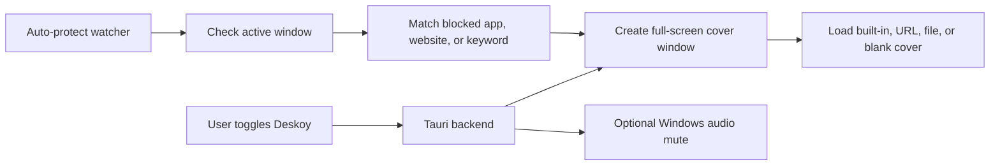

<div align="center">
  

  # Deskoy

  **A fast Windows privacy cover for sensitive moments.**

  Deskoy sits in your system tray and lets you replace your screen with a believable work surface when you need privacy quickly.

  [Website](https://www.deskoy.com) | [Download](https://www.deskoy.com/download) | [Docs](https://www.deskoy.com/docs) | [Support](https://www.deskoy.com/docs/support)
</div>

---

## What Deskoy Does

Deskoy is a desktop decoy utility built for everyday privacy gaps: screen-share surprises, shoulder-surfing, open sensitive tabs, and moments where a quick full-screen cover is easier than closing everything.

| Area | What it provides |
| --- | --- |
| Manual cover | Toggle a full-screen cover with a global hotkey. |
| Built-in covers | Excel, VS Code, Google Docs, Jira, BI dashboard, and blank screen presets. |
| Custom covers | Use a URL or local file as the cover source. |
| Auto-protect | Optionally cover blocked apps, websites, or title keywords when they become active. |
| Tray-first flow | Deskoy runs quietly from the Windows tray instead of staying in the way. |
| Feedback path | Feedback and bug reports can be sent directly to the Deskoy team. |

> Deskoy reduces casual exposure. It is not a security boundary, antivirus, DRM, or protection against malware, screen recording, remote administration tools, or a determined user with access to the machine.

---


## Product Highlights

- **Instant cover hotkey.** Configure a global shortcut, then show or hide the cover without hunting through windows.
- **Believable work surfaces.** Use built-in decoys that look like common productivity tools instead of obvious blank overlays.
- **Custom sources.** Point Deskoy at a URL or local file when your team needs a specific cover.
- **Auto Protect controls.** Target blocked apps, websites, and keywords with local protection logs.
- **Pause controls.** Pause Deskoy temporarily or until restart from the tray when you need it out of the way.
- **Audio option.** Manual hotkey covers can mute and restore Windows desktop audio when enabled.
- **User feedback path.** Built-in feedback and bug report forms help users reach the team from inside the app.

## Cover Modes

| Mode | Best for | Notes |
| --- | --- | --- |
| Excel | Office-like cover | Good default for work environments. |
| VS Code | Developer cover | Looks natural during engineering work. |
| Google Docs | Writing/document cover | Useful for docs-heavy teams. |
| Jira | Planning cover | Fits product and support workflows. |
| BI dashboard | Analytics cover | Works well in dashboard-heavy environments. |
| Blank | Minimal fallback | Pure black full-screen cover. |
| URL | Team-specific decoy | Some sites may block rendering because of auth, CSP, or browser restrictions. |
| File | Local custom cover | Images, PDFs, and text-like files are supported. |

## How It Works



The Tauri backend owns the tray, global shortcut, settings store, cover windows, Windows foreground-window checks, audio handling, diagnostics, and support requests. The renderer owns the settings UI.

## Get Started

For users:

1. Download Deskoy from [deskoy.com/download](https://www.deskoy.com/download).
2. Install the Windows setup package.
3. Open Deskoy from the tray or Start menu.
4. Choose a cover mode.
5. Set a hotkey.
6. Toggle Deskoy when you need a privacy cover.

For local development:

```powershell
cd C:\Users\User\Desktop\deskoy\deskoy-app
npm.cmd install
npm.cmd start
```

Use `npm.cmd` / `npx.cmd` on Windows PowerShell if script execution policy blocks `npm.ps1` or `npx.ps1`.

## Common Commands

| Command | Purpose |
| --- | --- |
| `npm.cmd start` | Run the Tauri app in development mode. |
| `npm.cmd run lint` | Type-check the TypeScript app surface. |
| `cargo check` | Compile-check the Tauri backend. |
| `cargo test` | Run Rust unit tests. |
| `npm.cmd audit --omit=dev` | Audit production runtime dependencies. |
| `npm.cmd run build` | Build the Vite frontend. |
| `npm.cmd run tauri:build` | Build Tauri distributables. |
| `npm.cmd run build:icons` | Regenerate app icons from `assets/logo.png`. |
| `npm.cmd run build:installer-assets` | Regenerate NSIS installer branding bitmaps. |

## Release Build

```powershell
cd C:\Users\User\Desktop\deskoy\deskoy-app
npm.cmd install
npm.cmd run lint
cargo check
cargo test
npm.cmd audit --omit=dev
npm.cmd run build
npm.cmd run tauri:build
```

Current Windows artifact path:

```text
src-tauri/target/release/bundle/nsis/Deskoy_1.2.4_arm64-setup.exe
```

Tauri packaging is configured in [src-tauri/tauri.conf.json](src-tauri/tauri.conf.json). Installer graphics are generated by [scripts/build-installer-assets.cjs](scripts/build-installer-assets.cjs).

## Repository Map

| Path | What lives there |
| --- | --- |
| `src-tauri/src/main.rs` | Tauri backend, tray, settings, shortcuts, cover windows, auto-protect, audio, diagnostics, and support requests. |
| `src/tauri-deskoy-api.ts` | Safe Tauri command/event bridge exposed to the renderer. |
| `src/legacy-ui.ts` | Settings UI behavior and front-end state. |
| `index.html` | Main settings window shell. |
| `public/cover/*` | Built-in cover pages. |
| `assets/*` | Logo, app icons, and installer art. |
| `src-tauri/tauri.conf.json` | Tauri window, bundle, icon, resource, and installer configuration. |
| `scripts/*` | Asset generation scripts for icons, loading GIF, and installer bitmaps. |

## Feedback And Bug Reports

Deskoy includes in-app feedback and bug report forms so users can send notes, issue reports, optional screenshots, and basic diagnostics to the team.

This path is intended for product support only. It keeps the desktop app simple for users while giving the team enough context to triage issues quickly.

## Configuration Notes

- Settings are stored in Deskoy's local JSON settings store.
- Default blocked title keywords are empty for fresh installs.
- Built-in cover mode is used when custom cover override is disabled or incomplete.
- Auto-protect is best-effort because Windows apps and browser titles expose different levels of information.

## Quality Checks

The current codebase is expected to pass:

```powershell
npm.cmd run lint
cargo check
cargo test
npm.cmd run build
npm.cmd audit --omit=dev
```

Production runtime dependencies currently audit clean with `npm.cmd audit --omit=dev`.

## Known Limitations

- Browser titles may not include full URLs.
- Some apps may refuse to close or minimize during auto-protect.
- Global shortcuts can fail if another app already owns the same key combination.
- URL covers depend on the target site allowing embedded Chromium rendering.
- Deskoy is a privacy convenience tool, not a security product.

## License

Deskoy is released under `LicenseRef-Deskoy-Source-Available-1.0`.

See [LICENSE](LICENSE) for the full license text.
