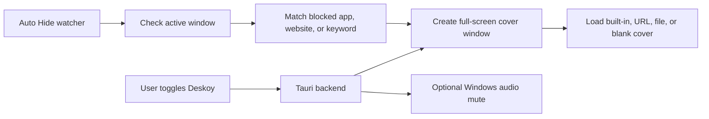

<div align="center">
  

  # Deskoy

  **A fast Windows privacy cover for sensitive moments.**

  Deskoy sits in your system tray and lets you replace your screen with a believable work surface when you need privacy quickly.

  [Website](https://www.deskoy.com) | [Download](https://www.deskoy.com/download) | [Docs](https://www.deskoy.com/docs) | [Support](https://www.deskoy.com/docs/support)
</div>

---

## What Deskoy Does

Deskoy is a desktop decoy utility built for everyday privacy gaps: screen-share surprises, shoulder-surfing, open sensitive tabs, and moments where a quick full-screen cover is easier than closing everything.

| Area | What it provides |
| --- | --- |
| Manual cover | Toggle a full-screen cover with a global hotkey. |
| Built-in covers | Excel, VS Code, Google Docs, Jira, BI dashboard, and blank screen presets. |
| Custom covers | Use a URL or local file as the cover source. |
| Auto Hide | Optionally cover blocked apps, websites, or title keywords when they become active. |
| Tray-first flow | Deskoy runs quietly from the Windows tray instead of staying in the way. |
| In-app updates | New signed releases can be installed from the Updates section in settings. |
| Feedback path | Feedback and bug reports can be sent directly to the Deskoy team. |

> Deskoy reduces casual exposure. It is not a security boundary, antivirus, DRM, or protection against malware, screen recording, remote administration tools, or a determined user with access to the machine.

---


## Product Highlights

- **Instant cover hotkey.** Configure a global shortcut, then show or hide the cover without hunting through windows.
- **Believable work surfaces.** Use built-in decoys that look like common productivity tools instead of obvious blank overlays.
- **Custom sources.** Point Deskoy at a URL or local file when your team needs a specific cover.
- **Auto Hide controls.** Target blocked apps, websites, and keywords with local protection logs.
- **Pause controls.** Pause Deskoy temporarily or until restart from the tray when you need it out of the way.
- **Audio option.** Manual hotkey covers can mute and restore Windows desktop audio when enabled.
- **In-app updates.** New signed versions can be installed from Deskoy's Updates section.
- **User feedback path.** Built-in feedback and bug report forms help users reach the team from inside the app.

## Cover Modes

| Mode | Best for | Notes |
| --- | --- | --- |
| Excel | Office-like cover | Good default for work environments. |
| VS Code | Developer cover | Looks natural during engineering work. |
| Google Docs | Writing/document cover | Useful for docs-heavy teams. |
| Jira | Planning cover | Fits product and support workflows. |
| BI dashboard | Analytics cover | Works well in dashboard-heavy environments. |
| Blank | Minimal fallback | Pure black full-screen cover. |
| URL | Team-specific decoy | Some sites may block rendering because of auth, CSP, or browser restrictions. |
| File | Local custom cover | Images, PDFs, and text-like files are supported. |

## How It Works


```mermaid
flowchart LR
  A["User toggles Deskoy"] --> B["Tauri backend"]
  B --> C["Create full-screen cover window"]
  C --> D["Load built-in, URL, file, or blank cover"]
  B --> E["Optional Windows audio mute"]
  F["Auto Hide watcher"] --> G["Check active window"]
  G --> H["Match blocked app, website, or keyword"]
  H --> C
```

The Tauri backend owns the tray, global shortcut, settings store, cover windows, Windows foreground-window checks, audio handling, diagnostics, and support requests. The renderer owns the settings UI.

## Get Started

For users:

1. Download Deskoy from [deskoy.com/download](https://www.deskoy.com/download).
2. Install the Windows setup package.
3. Open Deskoy from the tray or Start menu.
4. Choose a cover mode.
5. Set a hotkey.
6. Toggle Deskoy when you need a privacy cover.

For local development:

Install Node.js, Rust with the Windows MSVC toolchain, Microsoft C++ Build Tools,
and WebView2 first. Tauri's [Windows prerequisites](https://v2.tauri.app/start/prerequisites/)
describe the required components. Run these commands from the repository root:

```powershell
npm.cmd ci
npm.cmd start
```

Use `npm.cmd` / `npx.cmd` on Windows PowerShell if script execution policy blocks `npm.ps1` or `npx.ps1`.
The development build uses the existing Deskoy licence service. Pro entitlement
is still verified by the Rust client; this source release does not bypass it.
No licence or payment secret belongs in the desktop app or this repository. Do
not use real customer keys when testing a source build.

## Windows CLI

The Windows NSIS installer includes a separate `deskoy` CLI and adds its
directory to your user `PATH`. Open a new terminal after installing, then run
`deskoy --help`, `deskoy status`, or `deskoy cover toggle`. The desktop app
must be running for the last two commands.

For local source builds, build the CLI separately:

```powershell
cargo build --manifest-path cli/Cargo.toml
.\cli\target\debug\deskoy.exe --help
.\cli\target\debug\deskoy.exe --version
.\cli\target\debug\deskoy.exe status
.\cli\target\debug\deskoy.exe cover toggle
```

Do not replace the installed desktop app executable, which has the same name.
The CLI talks only to a running
Deskoy app in the same Windows session. `status` reports whether Deskoy and its cover are
active; `cover toggle` uses the app's existing hotkey path, including its Rust
Free/Pro cover checks. No licence key or activation command is exposed. If
Deskoy is not running, the CLI returns a clear error. The NSIS installer adds
only the CLI directory to the current user's `PATH` and removes that entry on
uninstall. The MSI bundle contains the CLI files but does not add them to `PATH`;
run its bundled `deskoy.cmd` explicitly if using MSI.

## Common Commands

| Command | Purpose |
| --- | --- |
| `npm.cmd start` | Run the Tauri app in development mode. |
| `npm.cmd run lint` | Type-check the TypeScript app surface. |
| `cargo check --manifest-path src-tauri/Cargo.toml` | Compile-check the Tauri backend. |
| `cargo test --manifest-path src-tauri/Cargo.toml` | Run Rust unit tests. |
| `npm.cmd run cli:test` | Run CLI tests. |
| `npm.cmd audit --omit=dev` | Audit production runtime dependencies. |
| `npm.cmd run build` | Build the Vite frontend. |
| `npm.cmd run tauri:build:unsigned` | Build the desktop executable locally without packaging or an updater signature. |
| `npm.cmd run tauri:build` | Build signed Tauri distributables for an authorised release. |
| `npm.cmd run build:icons` | Regenerate app icons from `assets/logo.png`. |
| `npm.cmd run build:installer-assets` | Regenerate NSIS installer branding bitmaps. |

## Fresh Source Build

```powershell
npm.cmd ci
npm.cmd run cli:build:release
npm.cmd run lint
cargo check --manifest-path src-tauri/Cargo.toml
cargo test --manifest-path src-tauri/Cargo.toml
npm.cmd run cli:test
npm.cmd audit --omit=dev
npm.cmd run build
npm.cmd run tauri:build:unsigned
```

Tauri packaging is configured in [src-tauri/tauri.conf.json](src-tauri/tauri.conf.json).
The unsigned command checks the desktop executable; it does not create an
installer or a signed update. Official releases additionally run
`npm.cmd run tauri:build` with the existing private
`TAURI_SIGNING_PRIVATE_KEY` supplied securely outside this repository.
Never generate a replacement key for an existing updater channel.

The production licence API, receipt verification **public** key, and updater
URL are configured in the desktop source because the official app needs them.
This repository contains only the desktop and CLI source, not the hosted
licence/payment service, licence administration tools, customer records, or
private signing keys. Building the app does not issue licences or deploy a
backend. The feedback/update-policy relay is also not part of this source
release.

## Repository Map

| Path | What lives there |
| --- | --- |
| `src-tauri/src/main.rs` | Tauri bootstrap and core app orchestration. |
| `src-tauri/src/auto_protect.rs` | Auto Hide rule matching and its unit tests. |
| `src-tauri/src/platform.rs` | Windows integration for process windows, single-instance handling, and audio controls. |
| `src-tauri/src/settings.rs` | Settings and profile normalization. |
| `src-tauri/src/feedback.rs` | Feedback and bug-report relay commands. |
| `src-tauri/src/updates.rs` | Release checks, in-app updates, and version policy. |
| `src-tauri/src/licensing.rs` | Device-bound Pro entitlement and protected local activation. |
| `src-tauri/src/cli_ipc.rs` | Local Windows CLI bridge to the running app's cover logic. |
| `cli/*` | Source for the optional Windows `deskoy` command. |
| `src/api/deskoy.ts` | Safe Tauri command/event bridge exposed to the renderer. |
| `src/legacy-ui/*` | Settings UI behavior, front-end state, and focused support modules. |
| `src/components/settings/*` | Settings window markup and update panel components. |
| `src/styles/*` | Main-window and settings-panel styles, loaded in order by `src/index.css`. |
| `index.html` | Main settings window shell. |
| `public/cover/*` | Built-in cover pages. |
| `assets/*` | Logo, app icons, and installer art. |
| `src-tauri/tauri.conf.json` | Tauri window, bundle, icon, resource, and installer configuration. |
| `scripts/*` | Asset generation scripts for icons, loading GIF, and installer bitmaps. |

## Feedback And Bug Reports

Deskoy includes in-app feedback and bug report forms so users can send notes, issue reports, optional screenshots, and basic diagnostics to the team.

This path is intended for product support only. It keeps the desktop app simple for users while giving the team enough context to triage issues quickly.

## Configuration Notes

- Settings are stored in Deskoy's local JSON settings store.
- Default blocked title keywords are empty for fresh installs.
- Built-in cover mode is used when custom cover override is disabled or incomplete.
- Auto Hide is best-effort because Windows apps and browser titles expose different levels of information.

## Quality Checks

The current codebase is expected to pass:

```powershell
npm.cmd run lint
cargo check --manifest-path src-tauri/Cargo.toml
cargo test --manifest-path src-tauri/Cargo.toml
npm.cmd run cli:test
npm.cmd run build
npm.cmd audit --omit=dev
```

Production runtime dependencies currently audit clean with `npm.cmd audit --omit=dev`.

## Known Limitations

- Browser titles may not include full URLs.
- Some apps may refuse to close or minimize during Auto Hide.
- Global shortcuts can fail if another app already owns the same key combination.
- URL covers depend on the target site allowing embedded Chromium rendering.
- Deskoy is a privacy convenience tool, not a security product.

## License

Deskoy-authored desktop and Windows CLI source, and the original Deskoy assets
in `assets/`, are licensed under `GPL-3.0-only`. See [LICENSE](LICENSE) for the
full text and [THIRD_PARTY_NOTICES.md](THIRD_PARTY_NOTICES.md) for third-party
attribution. Third-party packages retain their own licences; this code licence
does not grant rights to the Deskoy name or trademarks.
