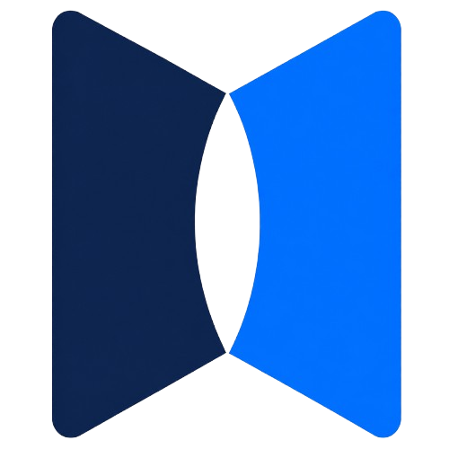

<div align="center">
  

  # Deskoy

  A quick privacy cover for Windows.

  [Download Deskoy](https://github.com/setjet/deskoy/releases/latest) · [Contribute](CONTRIBUTING.md)
</div>

Deskoy lives in the system tray. When you need a moment of privacy, a hotkey puts a full-screen cover over your desktop without making you close what you were doing.

**This repository contains the Deskoy v2 source.** The latest downloadable Windows release is still **v1.3.0** until a v2 release is published. Cloning this repository does not install or update the released app.

## What you can do

- Toggle a cover from a global hotkey or the tray.
- Choose from built-in work-style covers, including spreadsheets, documents, dashboards, and a blank screen.
- Save cover profiles and switch between them.
- Optionally mute desktop audio while a manual cover is active.
- Use Deskoy Pro for additional covers, custom URL or file covers, and Auto Hide rules for selected apps, sites, or window titles. Pro activation remains checked by the desktop app.

Deskoy is a privacy convenience, not a security boundary. It cannot stop screen recording, malware, or someone with access to your computer.

## Download

Get the current Windows installer from [GitHub Releases](https://github.com/setjet/deskoy/releases/latest). That download remains v1.3.0 until Deskoy v2 is released; the v2 code here is not yet a downloadable release.

## Windows CLI

The **v2 installer**, when released, will include a small `deskoy` command. It talks to the running desktop app and uses the app's existing cover permissions:

```text
deskoy --version
deskoy status
deskoy cover toggle
deskoy --help
```

`status` and `cover toggle` require Deskoy to be running. The CLI does not expose licence keys or bypass Pro checks. It is **not** part of the current v1.3.0 download.

## Development

On Windows, install Node.js 22, stable Rust with the MSVC toolchain, and the [Tauri Windows prerequisites](https://v2.tauri.app/start/prerequisites/). From the repository root:

```powershell
npm.cmd ci
npm.cmd run cli:build:release
npm.cmd start
```

See [CONTRIBUTING.md](CONTRIBUTING.md) for the full build and test steps. A source build does not issue Pro licences or include the hosted payment and licence service.

## Contributing

Bug fixes, accessibility improvements, tests, and documentation are welcome. Please read the [contribution guide](CONTRIBUTING.md) before opening a focused pull request.

## Licence

Deskoy v2's desktop and CLI source and Deskoy-authored assets are released under [GPL-3.0-only](LICENSE). Third-party packages retain their own terms; see [third-party notices](THIRD_PARTY_NOTICES.md). The Deskoy name and trademarks are not granted by the code licence.
